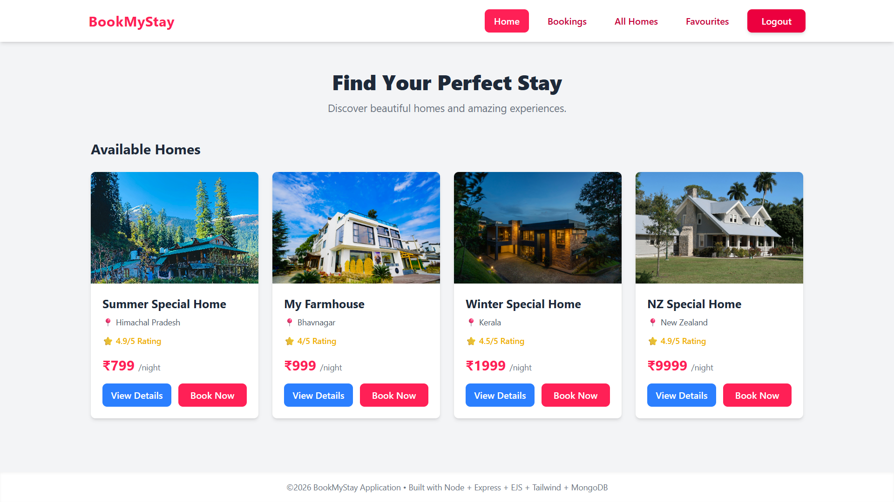
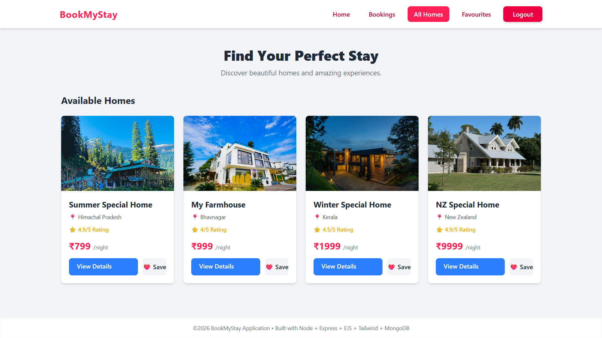
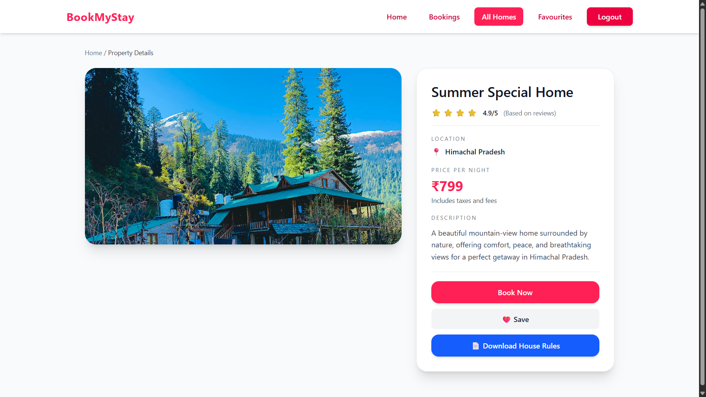
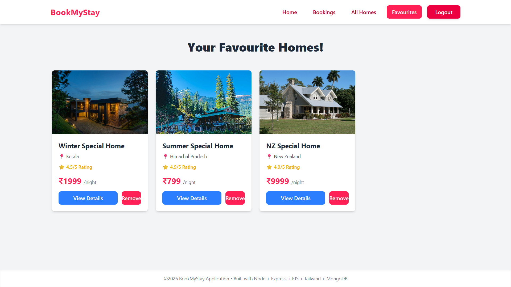
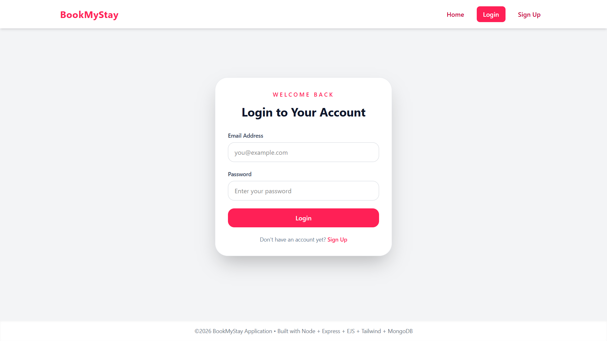
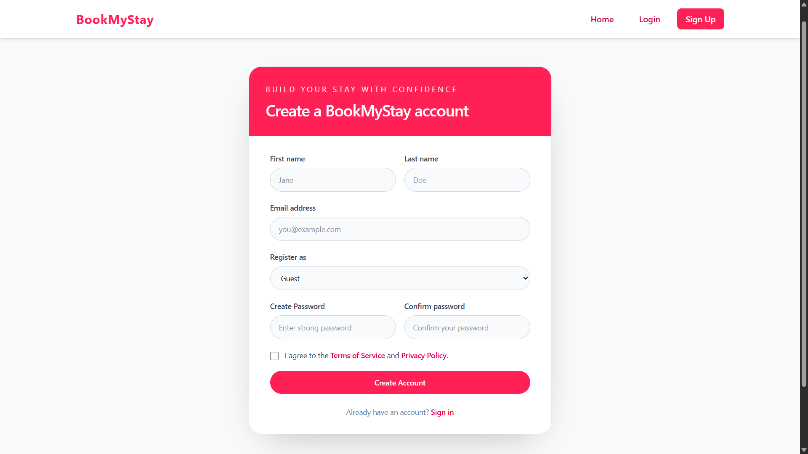
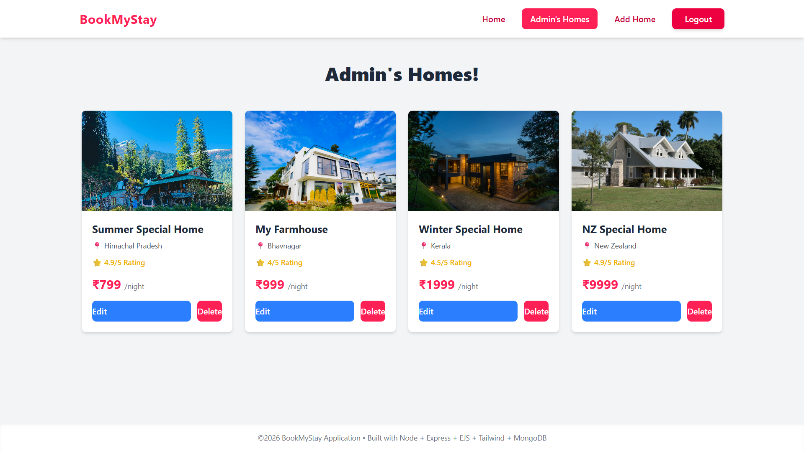
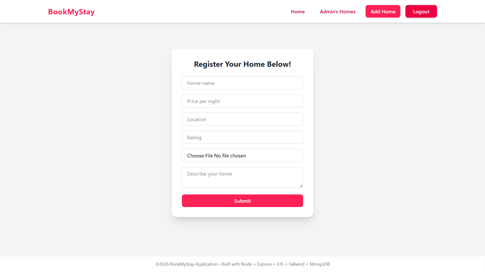

# 🏡 BookMyStay

A full-stack property listing and accommodation management platform built with **Node.js, Express.js, MongoDB, EJS, and Tailwind CSS**.

BookMyStay enables users to discover properties, view detailed listings, save favourites, and securely manage their accounts. Administrators can create, update, and manage property listings with image uploads powered by Cloudinary.

This project was developed to gain hands-on experience in real-world full-stack development by implementing backend architecture, database integration, authentication, authorization, file handling, cloud storage, and responsive user interfaces.

---

## 🚀 Live Demo

**Live Application:** https://bookmystay-m1dn.onrender.com

---
## 🔑 Demo

You can either:
- Register a new account, or
- Use the demo credentials below.

Admin:
Email: admin@gmail.com
Password: Admin@123

Guest:
Email: tarun0003g@gmail.com
Password: Tarun@123
---

## 📸 Application Screenshots

### 🏠 Home Page



### 🔍 Browse Homes



### 🏡 Property Details



### ❤️ Favourite Homes



### 🔐 Login



### 📝 Signup



### ⚙️ Admin Dashboard



### ➕ Add New Property



---

# ✨ Features

## 👤 User Features

* Browse available properties
* View detailed property information
* Save and manage favourite properties
* User registration and login
* Secure session-based authentication
* Download property house rules
* Personalized user experience

## 🛠️ Admin Features

* Add new property listings
* Edit existing properties
* Delete property listings
* Upload property images
* Manage platform content
* Cloud-based image storage

## 🔒 Security Features

* Password hashing using bcryptjs
* Session-based authentication
* Protected admin routes
* Input validation using express-validator
* File type validation
* Secure database storage
* Authorization middleware

## ☁️ Cloud Storage

* Cloudinary image hosting
* Persistent image storage
* Optimized image delivery
* No dependency on local server storage

---

# 🏗️ Tech Stack

## Backend

* Node.js
* Express.js
* Mongoose
* Multer
* Cloudinary
* bcryptjs
* express-session
* connect-mongodb-session
* express-validator

## Database

* MongoDB
* MongoDB Atlas
* MySQL (Learning & Practice Integration)

## Frontend

* EJS
* Tailwind CSS
* HTML5
* CSS3
* JavaScript

## Development Tools

* NPM
* Nodemon
* VS Code
* PostCSS
* Autoprefixer
* Concurrently

## Deployment

* Render
* MongoDB Atlas
* Cloudinary

---

# 🏛️ Project Architecture

The application follows the **MVC (Model-View-Controller)** architecture.

```text
BookMyStay
│
├── controllers
├── models
├── routes
├── middleware
├── utility
├── views
│   ├── partials
│   └── pages
├── public
│   ├── css
│   ├── js
│   └── images
├── screenshots
├── uploads
├── app.js
└── package.json
```

## MVC Breakdown

### Models

* MongoDB schema definitions
* Database operations
* Business logic

### Views

* EJS templates
* Dynamic rendering
* Reusable components

### Controllers

* Request handling
* Validation
* Application logic

### Routes

* Endpoint management
* Middleware integration
* Route organization

---

# 🧠 Concepts Implemented

## Node.js Concepts

* File System Operations
* Event Loop
* Async/Await
* Callbacks
* Module System
* Error Handling
* NPM Package Management

## Express.js Concepts

* Middleware Architecture
* Routing
* Request & Response Lifecycle
* Body Parsing
* Static File Serving
* Error Handling Middleware

## Database Concepts

* CRUD Operations
* Schema Design
* MongoDB Collections
* Data Persistence
* Querying
* Relationships
* Validation

## Authentication & Authorization

* User Registration
* Login & Logout
* Password Hashing
* Session Management
* Access Control
* Protected Routes

## File Handling

* Image Uploads
* Cloud Storage Integration
* File Validation
* Media Management

---

# ⚙️ Installation

## Clone Repository

```bash
git clone https://github.com/tarun0001g/BookMyStay.git
```

## Navigate Into Project

```bash
cd BookMyStay
```

## Install Dependencies

```bash
npm install
```

## Environment Variables

Create a `.env` file in the root directory:

```env
MONGO_URL=your_mongodb_connection_string

CLOUDINARY_CLOUD_NAME=your_cloud_name
CLOUDINARY_API_KEY=your_api_key
CLOUDINARY_API_SECRET=your_api_secret
```

## Run Development Server

```bash
npm run dev
```

## Start Production Server

```bash
npm start
```

---

# 🌟 Future Enhancements

The following features are planned for future development:

* Property Booking System
* Property Reviews & Ratings
* Advanced Search
* Filter-Based Search
* User Profiles
* JWT Authentication
* Email Verification
* Booking History
* Admin Analytics Dashboard
* Payment Gateway Integration
* Responsive User Dashboard
* Property Availability Calendar

---

# 📚 Learning Outcomes

This project helped strengthen practical understanding of:

* Full-Stack Web Development
* Backend Development
* MVC Architecture
* RESTful Application Design
* Authentication & Authorization
* Session Management
* Database Design
* Cloud Storage Integration
* Secure Coding Practices
* Deployment & Production Hosting

---

# 🚀 Deployment

The application is deployed using:

* Render (Application Hosting)
* MongoDB Atlas (Database)
* Cloudinary (Image Storage)

---

# 👨‍💻 Author

**Tarun Makavana**

Passionate Full-Stack Developer focused on building scalable web applications and continuously improving development skills through hands-on projects.

GitHub: https://github.com/tarun0001g
LinkedIn: www.linkedin.com/in/tarun-makavana-52601427a

